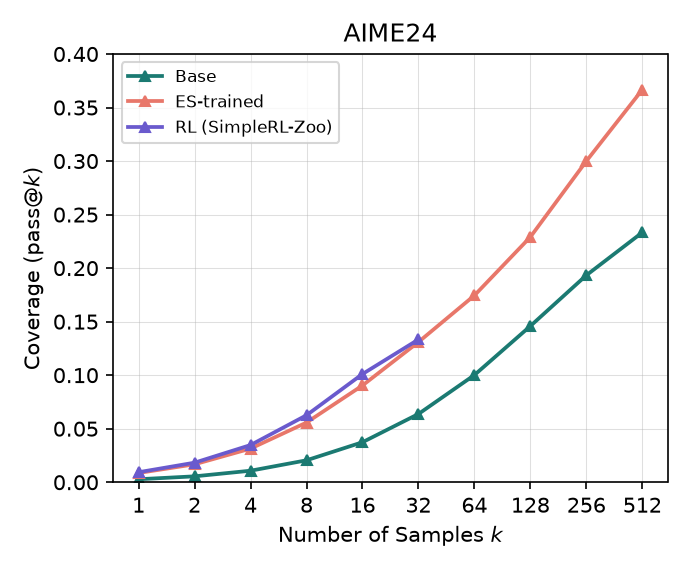
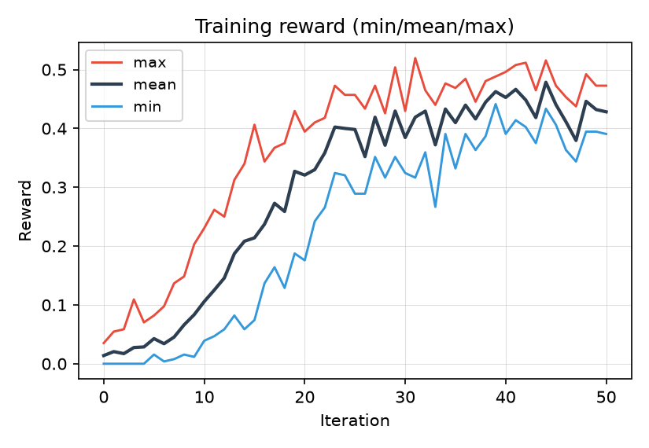
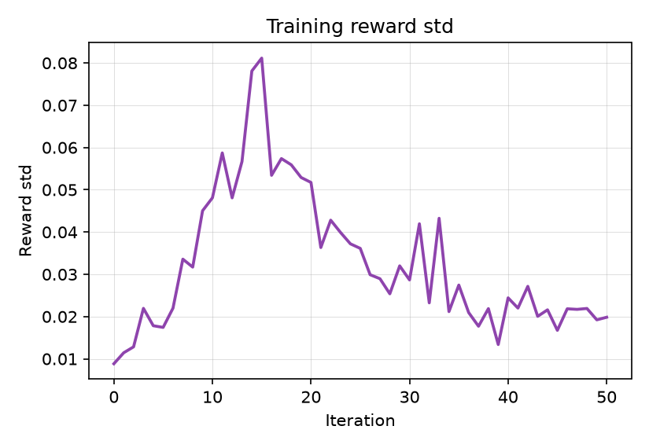
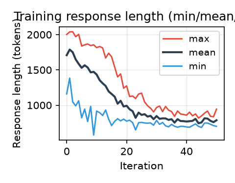
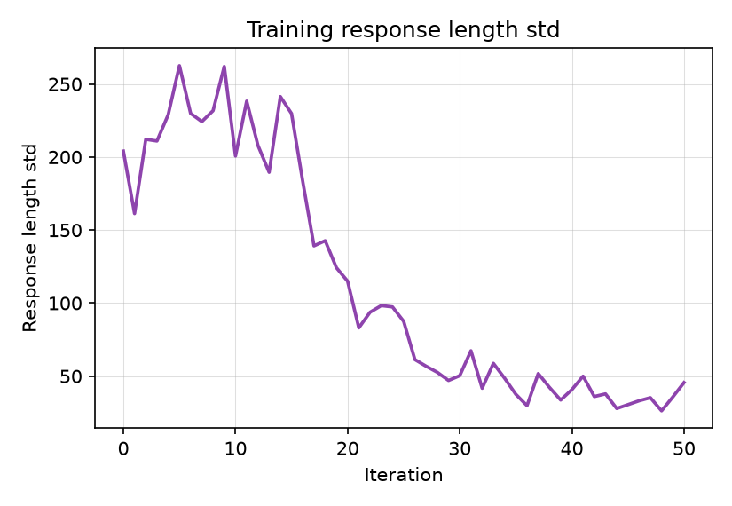

# ES-capacity

Does Evolution-Strategies post-training preserve a base model's pass@k
ceiling better than gradient-based RLVR (GRPO)? RLVR reliably raises pass@1
but tends to narrow the pass@k ceiling relative to the base model — this
project tests whether ES-based fine-tuning (gradient-free, population-based)
avoids that narrowing, on the same task/reward/data.

Training and evaluation run from forked, patched copies of the original
papers' code.

## Code

| Purpose | Repo | Branch | Notes |
|---|---|---|---|
| ES training | [Jaysen-Ma/es-at-scale](https://github.com/Jaysen-Ma/es-at-scale) (fork of [VsonicV/es-at-scale](https://github.com/VsonicV/es-at-scale), arXiv:2509.24372) | `fix/multi-engine-colocation` | Full-rank ES, Ray-orchestrated multi-engine vLLM. 3 fixes needed to run on a single-node multi-GPU box: vLLM ≥0.20 import compat, co-located-engine port/cache-collision + concurrent-compile races, `--start-iteration` resume support. Verified on 8x RTX 4090. |
| pass@k generation, grading, plotting | [Jaysen-Ma/limit-of-RLVR](https://github.com/Jaysen-Ma/limit-of-RLVR) (fork of [LeapLabTHU/limit-of-RLVR](https://github.com/LeapLabTHU/limit-of-RLVR), arXiv:2504.13837) | `fix/math-equal-timeout-bypass` | `math/examples/math_eval/` already implements the unbiased pass@k estimator and a full generate+grade harness (`math_eval.py`, `--n_sampling`). Fixes a real grading-worker hang (`math_equal`'s equation-comparison branch bypassed the timeout guard). |

Both forks' `main` are kept as unmodified mirrors of upstream; all changes
live on the branches above so they can be sent upstream as PRs later.

## Experiment 1: Qwen2.5-1.5B base vs. ES-at-scale-trained (done)

| Param | Value |
|---|---|
| Model | `Qwen/Qwen2.5-1.5B` (base, not Instruct) |
| Task | math |
| sigma | 0.001 |
| alpha (lr) | auto (`sigma/2` = 0.0005, `es-at-scale`'s default when `--alpha` is unset) |
| Population size | 32 |
| Iterations | 50 |
| Train dataset | `math_lvl3to5_8k` (matches SimpleRL-Zoo's training set) |
| Batch size / mini-batch size | 256 / 256 |
| Max tokens | 2048 |
| vLLM engines | 8 (one per GPU) |
| GPUs | 0-7 (8x RTX 4090 48GB) |
| Training wall-clock | 3h 22m 35s (including 2 evals) |

Train:
```bash
cd es-at-scale  # Jaysen-Ma/es-at-scale @ fix/multi-engine-colocation
python -m es_at_scale.train \
  --task math \
  --model-name Qwen/Qwen2.5-1.5B \
  --sigma 0.001 \
  --population-size 32 \
  --n-iterations 50 \
  --train-dataset datasets/train/math_lvl3to5_8k \
  --batch-size 256 --mini-batch-size 256 \
  --max-tokens 2048 \
  --n-vllm-engines 8 --use-gpus 0,1,2,3,4,5,6,7
```

Evaluate (base, ES-trained, and any third arm, all through identical
settings, sharded across every GPU — `n_sampling` = 512 for AIME24, 128 for
the rest):
```bash
cd ES-capacity
scripts/run_base_vs_trained_eval.sh <path-to-hf-checkpoint> iter50 aime24 512
scripts/run_base_vs_trained_eval.sh <path-to-hf-checkpoint> iter50 math500 128
scripts/run_base_vs_trained_eval.sh <path-to-hf-checkpoint> iter50 minerva_math 128
scripts/run_base_vs_trained_eval.sh <path-to-hf-checkpoint> iter50 olympiadbench 128
# or all 4 at once:
scripts/run_full_eval_suite.sh <path-to-hf-checkpoint> iter50

# third-arm (e.g. an RL baseline), reusing the base model's already-computed outputs:
scripts/run_third_model_full_suite.sh <third-model-dir> rl iter50 [n_sampling_override]
```
`convert_to_hf.py` first, if starting from a raw `es-at-scale` checkpoint —
see [Model](#model) below.

## Experiment 2: Qwen2.5-7B base vs. ES-at-scale-trained (next)

Same approach as Experiment 1 — Qiu et al. `es-at-scale`, `math_lvl3to5_8k`
(SimpleRL-Zoo-matched data) — scaled to the 7B base model. Not yet run;
sigma/population/iterations likely need retuning for 7B's larger memory
footprint on the same 8x RTX 4090 48GB box.

## Results

Three models compared on four benchmarks (AIME24, MATH500, Minerva Math,
OlympiadBench) at identical generation settings throughout (`temperature=0.6`,
`top_p=0.95`, `max_tokens=2048`, `qwen-boxed` template, `seed=1` — enforced by
shared wrapper scripts so runs can't drift: `scripts/run_base_vs_trained_eval.sh`,
`scripts/run_third_model_eval.sh`). `n_sampling` (= max k) is 512 for AIME24,
128 for the rest; each benchmark's full data range gets its own pass@k curve.

- **Base**: `Qwen/Qwen2.5-1.5B`
- **ES**: this project's Experiment 1 checkpoint
- **RL**: [hkust-nlp/Qwen-2.5-1.5B-SimpleRL-Zoo](https://huggingface.co/hkust-nlp/Qwen-2.5-1.5B-SimpleRL-Zoo),
  a real published GRPO-trained model, same base and (matched) training data

<table>
<tr>
<td>

| k | Base | ES | RL |
|---|---|---|---|
| 1 | 0.28% | 0.87% | 0.87% |
| 2 | 0.55% | 1.68% | 1.69% |
| 4 | 1.08% | 3.14% | 3.16% |
| 8 | 2.05% | 5.57% | 5.63% |
| 16 | 3.74% | 9.04% | 9.27% |
| 32 | 6.38% | 13.09% | 14.03% |
| 64 | 10.01% | 17.45% | 20.10% |
| 128 | 14.59% | 22.91% | 28.41% |
| 256 | 19.33% | 30.00% | 39.39% |
| 512 | 23.33% | 36.67% | 50.00% |

**AIME24** (30 questions, n=512)

</td>
<td>

| k | Base | ES | RL |
|---|---|---|---|
| 1 | 5.37% | 16.79% | 13.35% |
| 2 | 9.90% | 27.79% | 23.28% |
| 4 | 17.53% | 41.69% | 37.37% |
| 8 | 28.93% | 56.05% | 53.52% |
| 16 | 43.27% | 68.24% | 67.70% |
| 32 | 57.76% | 77.26% | 77.81% |
| 64 | 69.76% | 83.92% | 84.71% |
| 128 | 78.60% | 89.20% | 90.00% |

**MATH500** (500 questions, n=128)

</td>
</tr>
<tr>
<td>

| k | Base | ES | RL |
|---|---|---|---|
| 1 | 1.79% | 2.83% | 3.72% |
| 2 | 3.41% | 5.23% | 6.79% |
| 4 | 6.26% | 9.13% | 11.62% |
| 8 | 10.80% | 14.75% | 18.19% |
| 16 | 17.15% | 21.65% | 25.74% |
| 32 | 24.59% | 28.99% | 33.42% |
| 64 | 32.41% | 36.43% | 40.68% |
| 128 | 40.44% | 43.75% | 47.43% |

**Minerva Math** (272 questions, n=128)

</td>
<td>

| k | Base | ES | RL |
|---|---|---|---|
| 1 | 2.10% | 6.17% | 5.41% |
| 2 | 3.96% | 10.60% | 9.67% |
| 4 | 7.18% | 16.84% | 16.04% |
| 8 | 12.21% | 24.43% | 24.12% |
| 16 | 19.10% | 32.43% | 32.64% |
| 32 | 27.24% | 40.12% | 40.60% |
| 64 | 35.86% | 47.36% | 47.84% |
| 128 | 44.74% | 54.22% | 54.22% |

**OlympiadBench** (675 questions, n=128)

</td>
</tr>
</table>

   

**ES vs. base: no crossover on any of the 4 benchmarks** — ES stays above
base across the entire k range tested, unlike the pass@k-ceiling-narrowing
pattern the source RLVR paper documents for gradient-based methods.
Solvable/unsolvable breakdown ("solvable" = at least 1 of `n_sampling`
completions correct) confirms this nets positive everywhere, gains
consistently outweighing losses:

| Benchmark | ES: narrow / gain / **net** | RL: narrow / gain / **net** |
|---|---|---|
| AIME24 | 0.0% / 13.3% / **+13.3** | 3.3% / 30.0% / **+26.7** |
| MATH500 | 1.4% / 12.0% / **+10.6** | 1.2% / 12.6% / **+11.4** |
| Minerva | 7.0% / 10.3% / **+3.3** | 5.5% / 12.5% / **+7.0** |
| OlympiadBench | 3.9% / 13.3% / **+9.4** | 3.4% / 12.9% / **+9.5** |

**ES vs. RL is a mixed picture, not a clean win for either.** RL narrows
*less* than ES on 3 of 4 benchmarks and matches or exceeds ES's net gain on
all 4. No consistent crossover pattern either:

- **AIME24**: RL and ES are essentially tied through k≈16, then RL's lead
  *grows* with k, reaching pass@512 = 50.0% vs ES's 36.7% (n=30 questions
  here, so the noisiest of the four benchmarks).
- **MATH500**: RL starts *below* ES at low k (pass@1: 13.4% vs 16.8%),
  crosses over around k≈16-32, finishes slightly ahead at k=128 (90.0% vs
  89.2%).
- **Minerva**: RL stays above ES at every k from 1 to 128, gap plateauing
  around +3.5 to +4.4 points by k≥16.
- **OlympiadBench**: the two stay close throughout (within ±1 point),
  converging to a near-exact tie by k=128.

**Not a compute-matched comparison.** SimpleRL-Zoo is a mature, fully-trained
public model; this project's ES run is 50 iterations / 3h22m on one 8-GPU
box. RL matching or slightly outperforming ES here doesn't rule out ES
preserving capacity better under matched compute — that comparison hasn't
been run yet. What does hold regardless: ES itself shows no crossover and a
clean net-positive result relative to the base model on all 4 benchmarks.

Raw generations for all three arms: `results/iter50/{base,trained,rl}/`.
`base`/`trained` are gitignored (regenerate with
`scripts/run_base_vs_trained_eval.sh`); `results/iter50/rl/` (~1GB) is
committed as-is for convenience despite the gitignore rule — plan to
`git rm -r --cached` it in a follow-up cleanup pass.

## Training dynamics

Per-iteration stats logged to W&B during training (min/mean/max across the
population of 32, plus std), reward and response length:

<table><tr>
<td></td>
<td></td>
<td></td>
<td></td>
</tr></table>

Reward climbs steadily and plateaus around iteration ~25-30. Response length
falls the whole time — from a population mean of ~1700 tokens at iteration 0
down to ~800 by the end — the model is learning to be *more concise* while
getting *more correct*, not just running longer. Both std curves peak early
(iteration ~10-15, while the population is still exploring the reward
landscape) and then decay, consistent with the population converging on a
consistent style/strategy rather than staying diffuse.

Regenerate with `scripts/plot_training_curves.py --wandb-run
chunhinma00-personal/es-finetuning/it2de910 --out-dir results/iter50` (or
`--csv results/iter50/training_curves.csv` from the saved snapshot).

## Model

The ES-trained checkpoint is published at
[zocrate/Qwen2.5-1.5B-ES-math](https://huggingface.co/zocrate/Qwen2.5-1.5B-ES-math)
(HF format, converted from the raw `es-at-scale` checkpoint with
`scripts/convert_to_hf.py --verify`).

## Later

- Experiment 2 (7B, above) is next.
- A compute-matched RL baseline (capped at similar wall-clock/FLOP budget to
  the ES run, rather than comparing against an already fully-trained public
  checkpoint) would make the ES-vs-RL comparison fair — currently open.
- A fourth arm testing EGGROLL (Sarkar et al., arXiv:2511.16652 — rank-r
  LoRA-factorized ES, as opposed to `es-at-scale`'s full-rank ES).
- Clean up `results/iter50/rl/` out of git history once downloaded locally
  (see note in Results above).
