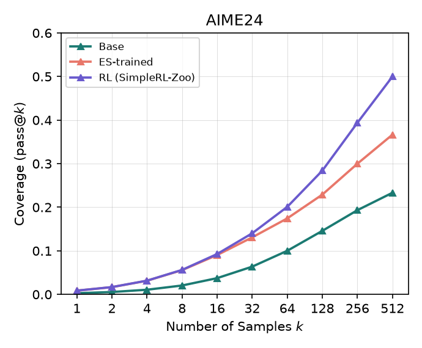
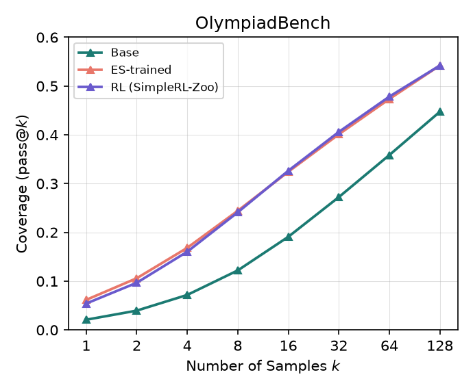
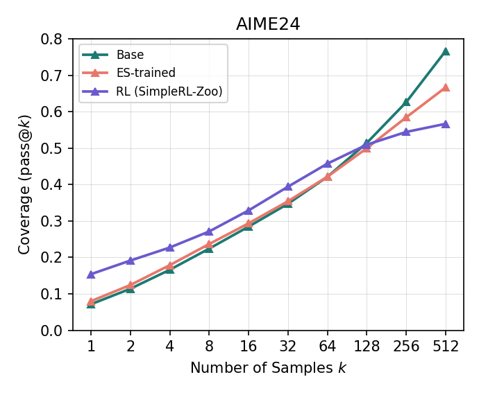
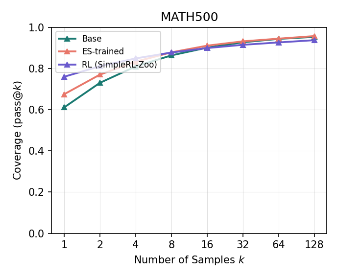
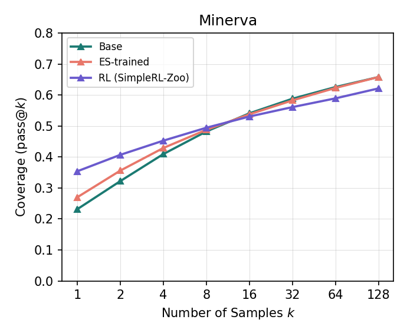
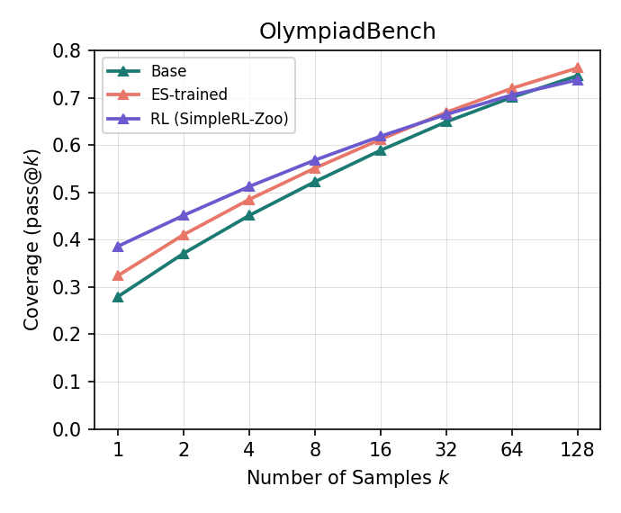

# ES-capacity

Does Evolution-Strategies (ES) post-training preserve a base model's pass@k
ceiling better than gradient-based RLVR (GRPO)? RLVR reliably raises pass@1
but tends to narrow the pass@k ceiling relative to the base model — this
project tests whether ES-based fine-tuning avoids that narrowing, on the same task/reward/data.

### Method

Two base models — `Qwen2.5-1.5B` and `Qwen2.5-7B`, each compared against two post-trained arms on the same task, reward and data:

- **ES** — full-parameter, backprop-free evolution strategies, σ=0.001,
  population 32, 50 iterations, batch 256, 2,048-token cap. Method and
  training code are Qiu et al.'s
  ([arXiv:2509.24372](https://arxiv.org/abs/2509.24372)). The hyperparameters
  above are **identical at both scales**.
- **RL** — the published SimpleRL-Zoo GRPO checkpoint at the matching scale
  ([arXiv:2503.18892](https://arxiv.org/abs/2503.18892)), trained on the same
  problems but at a much larger budget (see [ES vs. RL](#es-vs-rl)).

Both arms are scored against their own base on AIME24, MATH500, Minerva Math
and OlympiadBench at identical generation settings, on two measures: the
**pass@k curve**, which asks whether a trained model stays above its base as k
grows, and a **per-question solvable/unsolvable breakdown**, which asks how
many questions it gained and how many it lost. That framing — pass@k as a
capacity ceiling RLVR tends to narrow — is Yue et al.'s
([arXiv:2504.13837](https://arxiv.org/abs/2504.13837)).

### Main results

**At 1.5B, neither method narrows anything.** ES and RL both sit above base at
*every* measured k on all four benchmarks — no crossover anywhere — and both
expand question coverage on all four. ES tracks RL at pass@16 on three of the four benchmarks, on ~1/8 the
data budget.

**At 7B, the two arms separate.** RL buys the larger pass@1 gain against ES and pays for it at high k, falling
below base on all four benchmarks. ES
stays at or above base at every k on three of the four benchmarks.

That is an early hint that ES preserves the ceiling better than RLVR. Two things blunt it: the comparison is **not
compute-matched** — the 7B RL checkpoint took ~15h on 2 nodes of 8x H100,
the 7B ES run 4h35m on 8x RTX 4090 48GB; and 50 iterations is 1/10 of what
Qiu et al. recommend, so the ES arm may simply be under-trained. More runs
across models, hyperparameters and datasets are needed before the claim
carries weight.

## **ES vs. RL** 

**Not a compute-matched comparison — and the mismatch is different on each
axis.** Both arms train on the same **8,523 problems** (level3to5), but they
spend their budget on different things:

| | Prompts/step | Steps | ×per prompt | Prompt-exposures | **Epochs** | Generations | Training Token cap |
|---|---|---|---|---|---|---|---|
| **ES** (arxiv2509.24372) | 256 | 50 | 32 population | 12,800 | **1.50** | 409,600 | 2,048 |
| **RL** (arxiv2503.18892) | 1,024 | ~100 | 8 rollouts | 102,400 | **12.01** | 819,200 | 8,192 |
| **ratio (RL / ES)** | 4x | 2x | 0.25x | **8.00x** | **8.00x** | **2.00x** | **4x** |

The two ratios that matter come apart: RL sees **8x more data** but runs only
**2x more generations**. That is the whole structural difference between the
methods. RL spends its generation budget on **data breadth**, ES spends its
budget on **parameter breadth**. 

**On "rollouts" vs "population"**: 

Both multiply the
per-step generation count. GRPO rollout
is a sample from one policy used to estimate an advantage for one prompt, and
the actual descent direction comes from backprop. An ES population member is a
different point in parameter space, and the population *is* the entire gradient
estimator.

### Reading any ES-vs-RL curve in this repo

Four differences apply to every ES-vs-RL comparison here, at both scales. 

| Difference | ES | RL | Which way it cuts |
|---|---|---|---|
| Training token cap | 2,048 | 8,192 | Favours RL on long-form problems. Our eval caps generation at 2,048, so RL's extra training-time length can't be *scored* here, but it may still have shaped the policy. |
| Data budget | 1.50 epochs | 12.01 epochs | Favours RL, heavily. |
| Generations | 409,600 | 819,200 | Favours RL, 2x. |
| Compute budget | 8 * RTX4090 | 2 nodes of 8 * H100 | Maybe I will own a giant cluster of B300s soon. |

## Experiment

One recipe, two scales. Same task, same reward, same data, same ES
hyperparameters — **only the base model changes** (1.5B → 7B).

| Param | 1.5B run | 7B run |
|---|---|---|
| Model | `Qwen/Qwen2.5-1.5B` (base) | `Qwen/Qwen2.5-7B` (base) |
| Task | math | math |
| sigma | 0.001 | 0.001 |
| alpha (lr) | auto (`sigma/2` = 0.0005) | auto (`sigma/2` = 0.0005) |
| Population size | 32 | 32 |
| Iterations | 50 | 50 |
| Train dataset | `math_lvl3to5_8k` — the same 8,523 problems, in the same order, as SimpleRL-Zoo's `simplelr_qwen_level3to5` split | same |
| Evaluation dataset | `datasets/evaluation_suite/math` — omit it and it defaults to the `countdown` task's, which has no `problem` field and crashes the trainer | same |
| Batch size / mini-batch size | 256 / 256 | 256 / 256 |
| Max tokens | 2048 | 2048 |
| vLLM engines | 8 (one per GPU) | 8 (one per GPU) |
| GPUs | 0-7 (8x RTX 4090 48GB) | 0-7 (8x RTX 4090 48GB) |
| *Training wall-clock* | *3h 22m 35s* | *4h 35m 33s* |

Wall-clock is an outcome of the run, not a training parameter — every knob
above is identical across the two scales.

## Results

Three models per scale (base, ES-trained, RL) on four benchmarks (AIME24,
MATH500, Minerva Math, OlympiadBench) at identical generation settings
throughout (`temperature=0.6`, `top_p=0.95`, `max_tokens=2048`, `qwen-boxed`
template, `seed=1`). `n_sampling` (= max k) is 512 for AIME24, 128 for the
rest; each benchmark's full data range gets its own pass@k curve. The RL arm
is the published SimpleRL-Zoo checkpoint at the matching scale.

**Qwen2.5-1.5B**

<table>
<tr>
<td></td>
<td></td>
</tr>
<tr>
<td></td>
<td></td>
</tr>
</table>

**Qwen2.5-7B**

<table>
<tr>
<td></td>
<td></td>
</tr>
<tr>
<td></td>
<td></td>
</tr>
</table>

### pass@1 and pass@max

base→ES→RL, in percent:

| Benchmark | 1.5B pass@1 | 1.5B pass@max | 7B pass@1 | 7B pass@max |
|---|---|---|---|---|
| AIME24 (n=30, k≤512) | 0.28→0.87→0.87 | 23.33→36.67→50.00 | 7.14→7.98→15.39 | 76.67→66.67→56.67 |
| MATH500 (n=500, k≤128) | 5.37→16.79→13.35 | 78.60→89.20→90.00 | 61.15→67.54→76.04 | 95.40→95.80→93.80 |
| Minerva (n=272, k≤128) | 1.79→2.83→3.72 | 40.44→43.75→47.43 | 23.14→26.99→35.38 | 65.81→65.81→62.13 |
| OlympiadBench (n=675, k≤128) | 2.10→6.17→5.41 | 44.74→54.22→54.22 | 27.95→32.39→38.59 | 74.67→76.30→73.78 |

### Solvable/unsolvable breakdown

"Solvable" = at least 1 of `n_sampling` completions correct. narrow = questions
the base solves and the trained model doesn't; gain = the reverse; **net** =
gain − narrow, all as % of the benchmark's questions.

| Benchmark | 1.5B ES: narrow / gain / **net** | 1.5B RL: narrow / gain / **net** | 7B ES: narrow / gain / **net** | 7B RL: narrow / gain / **net** |
|---|---|---|---|---|
| AIME24 | 0.0% / 13.3% / **+13.3** | 3.3% / 30.0% / **+26.7** | 13.3% / 3.3% / **−10.0** | 23.3% / 3.3% / **−20.0** |
| MATH500 | 1.4% / 12.0% / **+10.6** | 1.2% / 12.6% / **+11.4** | 1.0% / 1.4% / **+0.4** | 3.0% / 1.4% / **−1.6** |
| Minerva | 7.0% / 10.3% / **+3.3** | 5.5% / 12.5% / **+7.0** | 2.9% / 2.9% / **0.0** | 5.1% / 1.5% / **−3.6** |
| OlympiadBench | 3.9% / 13.3% / **+9.4** | 3.4% / 12.9% / **+9.5** | 3.4% / 5.0% / **+1.6** | 5.5% / 4.6% / **−0.9** |

### Reading the two scales together

At 1.5B, both RL and ES looked like genuine capacity expansion. ES matches RL at pass@16 on 3 of 4 benchmarks at lower compute budget and ~1/8 data budget. 

At 7B, we observe the RL sampling-efficiency gain and capacity crossovers on all four benchmarks. For ES, pass@k at low k improved slightly, while preserving the base's capacity on 3 benchmarks. Qiu et al. suggest 500 iterations as the default, where we ran 1/10 of the documented generations in this experiment. One could argue the ES models here are under-trained.

**The limit on all of the above.** Both readings turn on budget rather than on
method. The 1.5B result says ES matched RL on a fraction of the data; the 7B
result says ES may simply be under-trained at 50 iterations. Neither can be
settled against a fully-trained public checkpoint that saw 8x the data, 2x the
generations and 4x the token cap — an ES arm we control has to be compared
against an RL arm we also control. That is the next proposed experiment.

## Planned: "matched-budget" ES vs. RL

**Not yet run.** The single biggest weakness in this repo is that every
ES-vs-RL number compares an ES run to an already-fully-trained public
checkpoint.

Retrain both the ES and RL arm at **batch 1024, 32 samples per
prompt**:

| | Steps | Prompts/step | ×per prompt | Exposures | Epochs | Generations |
|---|---|---|---|---|---|---|
| ES | 50 | 1024 | 32 population | 51,200 | 6 | 1,638,400 |
| GRPO | 50 | 1024 | 32 rollouts | 51,200 | 6 | 1,638,400 |
| ES | 100 | 1024 | 32 population | 102,400 | 12 | 3,276,800 |
| GRPO | 100 | 1024 | 32 rollouts | 102,400 | 12 | 3,276,800 |

### The protocol

1. **Train our own ES and GRPO arm** at batch 1024 / 32 rollouts, rather than using the
   public checkpoint — the only way to control the budget. Also set
   `max_response_length=2048` to match ES and the eval, removing the token-cap
   confound in the same stroke.
2. **Record wall-clock and total generated tokens alongside generations**, so
   every result can be read under any of the three denominators (see below).
3. **Run the existing pass@k suite**

### The other axis: matched wall-clock

Generation parity is one denominator, and it is the one that isolates the
*method*. It is not the one a practitioner spends. The second protocol is
therefore the same two arms on the same box, each stopped at the same
wall-clock budget, reporting whatever number of steps each got through.

The two axes disagree by construction, which is the point. At the reshaped
geometry both arms generate 32,768 completions per step, but they pay for
them differently: GRPO adds a backward pass and optimizer state over the full
model, while ES is forward-only and its per-step cost is population
evaluation plus perturbation overhead. 

Fixing generations therefore hands ES
the cheaper step, and fixing wall-clock hands ES more steps — if that is
where the advantage comes from, a generations-matched table will hide it and
a time-matched one will show it. Memory follows the same split: ES holds no
optimizer state, which is why this project's ES runs fit on 8x RTX 4090 at
all.

## Out-of-domain check: GPQA-diamond

All post-training here is math-only, so the next question is does ES or RL cause model degrading and catastrophic forgetting elsewhere. GPQA-diamond zero-shot is the first probe: 198 graduate-level
science questions, four choices each, scored by log-likelihood over the four
options. All
six arms, each scored under 10 different shuffles of the answer choices, with
every arm seeing the identical shuffle within a seed.

| Arm | mean acc over 10 permutations | sd | min | max |
|---|---|---|---|---|
| 1.5B-base | 23.79% | 2.23 | 20.71% | 28.79% |
| 1.5B-ES | 25.05% | 3.12 | 20.20% | 29.29% |
| 1.5B-RL | 23.69% | 2.81 | 18.18% | 28.28% |
| 7B-base | 25.45% | 2.53 | 21.72% | 27.78% |
| 7B-ES | 25.00% | 1.91 | 22.22% | 28.28% |
| 7B-RL | 26.01% | 2.61 | 21.72% | 28.79% |

**Both base models answer GPQA-diamond no better than random guessing, so this
benchmark cannot answer the question.** There is no headroom to lose. 

Measuring what
math-only post-training costs elsewhere needs a benchmark these two bases
already score above chance on. The proposed measurement is full MMLU — 57 subjects, scored per domain. That is what makes
"what did math-only post-training cost the humanities?" answerable at all.

## Appendix

### Code
Training and evaluation run from forked, patched copies of the original
papers' code.

| Purpose | Repo | Branch | Notes |
|---|---|---|---|
| ES training | [Jaysen-Ma/es-at-scale](https://github.com/Jaysen-Ma/es-at-scale) (fork of [VsonicV/es-at-scale](https://github.com/VsonicV/es-at-scale), arXiv:2509.24372) | `fix/multi-engine-colocation` | Fixes needed to run on a single-node 8x RTX 4090 instance on Vast. |
| pass@k generation, grading, plotting | [Jaysen-Ma/limit-of-RLVR](https://github.com/Jaysen-Ma/limit-of-RLVR) (fork of [LeapLabTHU/limit-of-RLVR](https://github.com/LeapLabTHU/limit-of-RLVR), arXiv:2504.13837) | `fix/math-equal-timeout-bypass` | Fixes a grading-worker hang. |

### Evaluation wall-clock

Convert the raw `es-at-scale` checkpoint to HF format first. Per-benchmark
generation time, 8x RTX 4090 48GB, sharded across all 8 GPUs:

| Benchmark | Gens/model | 1.5B base | 1.5B ES | 1.5B RL | 7B base | 7B ES | 7B RL |
|---|---|---|---|---|---|---|---|
| AIME24 (k=512) | 15,360 | 5m23s | 4m34s | 5m24s | 13m41s | 13m12s | — |
| MATH500 (k=128) | 64,000 | 3m38s | 2m40s | 3m18s | 11m19s | 26m07s | — |
| Minerva (k=128) | 34,816 | 4m32s | 4m08s | 5m05s | 24m33s | 25m07s | — |
| OlympiadBench (k=128) | 86,400 | 5m54s | 9m41s | 7m33s | 40m21s | 43m17s | — |
| **Total** | | **19m27s** | **21m02s** | **21m20s** | **1h30m** | **1h48m** | — |

The 7B RL generations were run on a separate 8x RTX 3090 instance, not the
4090 box, so their wall-clock isn't comparable to the rest of the table and
wasn't recorded.

### Training dynamics

Per-iteration reward for every run — including the aborted sigma sweeps not
reported above — is in `results/<run>/training_curves.csv`.

### Published checkpoints

In HF format, converted from the raw `es-at-scale` checkpoints with
`scripts/convert_to_hf.py`.

| Run | Checkpoint |
|---|---|
| 1.5B, σ=0.001, iter50 | [zocrate/Qwen2.5-1.5B-ES-math](https://huggingface.co/zocrate/Qwen2.5-1.5B-ES-math) |
| 7B, σ=0.001, iter50 | [zocrate/Qwen2.5-7B-ES-math](https://huggingface.co/zocrate/Qwen2.5-7B-ES-math) | 