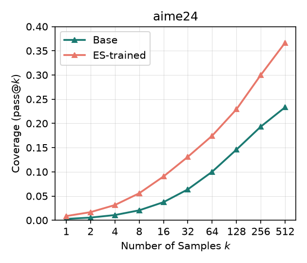
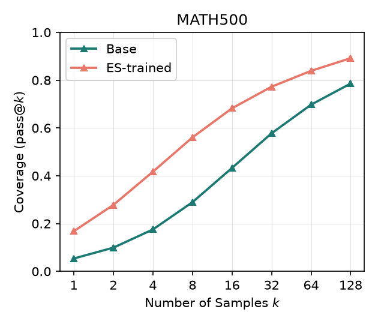
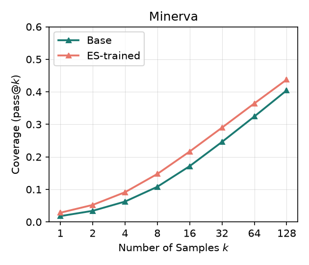
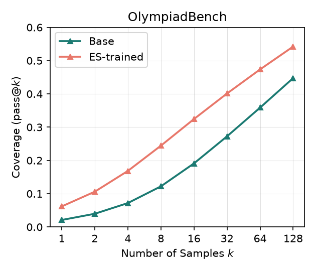

# ES-capacity

Does Evolution-Strategies post-training preserve a base model's pass@k
ceiling better than gradient-based RLVR (GRPO)? RLVR reliably raises pass@1
but tends to narrow the pass@k ceiling relative to the base model — this
project tests whether ES-based fine-tuning (gradient-free, population-based)
avoids that narrowing, on the same task/reward/data.

Training and evaluation run from forked, patched copies of the original
papers' code.

## Code

| Purpose | Repo | Branch | Notes |
|---|---|---|---|
| ES training | [Jaysen-Ma/es-at-scale](https://github.com/Jaysen-Ma/es-at-scale) (fork of [VsonicV/es-at-scale](https://github.com/VsonicV/es-at-scale), arXiv:2509.24372) | `fix/multi-engine-colocation` | Full-rank ES, Ray-orchestrated multi-engine vLLM. 3 fixes needed to run on a single-node multi-GPU box: vLLM ≥0.20 import compat, co-located-engine port/cache-collision + concurrent-compile races, `--start-iteration` resume support. Verified on 8x RTX 4090. |
| pass@k generation, grading, plotting | [Jaysen-Ma/limit-of-RLVR](https://github.com/Jaysen-Ma/limit-of-RLVR) (fork of [LeapLabTHU/limit-of-RLVR](https://github.com/LeapLabTHU/limit-of-RLVR), arXiv:2504.13837) | `fix/math-equal-timeout-bypass` | `math/examples/math_eval/` already implements the unbiased pass@k estimator and a full generate+grade harness (`math_eval.py`, `--n_sampling`). Fixes a real grading-worker hang (`math_equal`'s equation-comparison branch bypassed the timeout guard). |

Both forks' `main` are kept as unmodified mirrors of upstream; all changes
live on the branches above so they can be sent upstream as PRs later.

## Experiment 1: Qwen2.5-1.5B base vs. ES-at-scale-trained

| Param | Value |
|---|---|
| Model | `Qwen/Qwen2.5-1.5B` (base, not Instruct) |
| Task | math |
| sigma | 0.001 |
| alpha (lr) | auto (`sigma/2` = 0.0005, `es-at-scale`'s default when `--alpha` is unset) |
| Population size | 32 |
| Iterations | 50 |
| Train dataset | `math_lvl3to5_8k` (matches SimpleRL-Zoo's training set) |
| Batch size / mini-batch size | 256 / 256 |
| Max tokens | 2048 |
| vLLM engines | 8 (one per GPU) |
| GPUs | 0-7 (8x RTX 4090 48GB) |
| Training wall-clock | 3h 22m 35s (including 2 evals) |

Train:
```bash
cd es-at-scale  # Jaysen-Ma/es-at-scale @ fix/multi-engine-colocation
python -m es_at_scale.train \
  --task math \
  --model-name Qwen/Qwen2.5-1.5B \
  --sigma 0.001 \
  --population-size 32 \
  --n-iterations 50 \
  --train-dataset datasets/train/math_lvl3to5_8k \
  --batch-size 256 --mini-batch-size 256 \
  --max-tokens 2048 \
  --n-vllm-engines 8 --use-gpus 0,1,2,3,4,5,6,7
```

Evaluate (base, ES-trained, and any third arm, all through identical
settings, sharded across every GPU — `n_sampling` = 512 for AIME24, 128 for
the rest):
```bash
cd ES-capacity
scripts/run_base_vs_trained_eval.sh <path-to-hf-checkpoint> iter50 aime24 512
scripts/run_base_vs_trained_eval.sh <path-to-hf-checkpoint> iter50 math500 128
scripts/run_base_vs_trained_eval.sh <path-to-hf-checkpoint> iter50 minerva_math 128
scripts/run_base_vs_trained_eval.sh <path-to-hf-checkpoint> iter50 olympiadbench 128
# or all 4 at once:
scripts/run_full_eval_suite.sh <path-to-hf-checkpoint> iter50

# third-arm (e.g. an RL baseline), reusing the base model's already-computed outputs:
scripts/run_third_model_full_suite.sh <third-model-dir> rl iter50 [n_sampling_override]
```
`convert_to_hf.py` first, if starting from a raw `es-at-scale` checkpoint —
see [Model](#model) below.

## Results

Four benchmarks (AIME24, MATH500, Minerva Math, OlympiadBench), identical
generation settings across every model compared on a given benchmark
(`temperature=0.6`, `top_p=0.95`, `max_tokens=2048`, `qwen-boxed` template,
`seed=1` — enforced by shared wrapper scripts so runs can't drift:
`scripts/run_base_vs_trained_eval.sh`, `scripts/run_third_model_eval.sh`).
`n_sampling` (= max k) is 512 for AIME24, 128 for the other three — matching
this project's established convention, and each benchmark's full data range
gets its own pass@k curve (not truncated to a shared minimum).

### ES vs. base

**On every one of the 4 benchmarks, the ES-trained model stays above the base
model across the entire k range tested — no crossover, unlike the
pass@k-ceiling-narrowing pattern the source RLVR paper documents for
gradient-based methods.**

<table>
<tr>
<td>

| k | Base | ES-trained |
|---|---|---|
| 1 | 0.28% | 0.87% |
| 2 | 0.55% | 1.68% |
| 4 | 1.08% | 3.14% |
| 8 | 2.05% | 5.57% |
| 16 | 3.74% | 9.04% |
| 32 | 6.38% | 13.09% |
| 64 | 10.01% | 17.45% |
| 128 | 14.59% | 22.91% |
| 256 | 19.33% | 30.00% |
| 512 | 23.33% | 36.67% |

**AIME24** (30 questions, n=512)

</td>
<td>

| k | Base | ES-trained |
|---|---|---|
| 1 | 5.37% | 16.79% |
| 2 | 9.90% | 27.79% |
| 4 | 17.53% | 41.69% |
| 8 | 28.93% | 56.05% |
| 16 | 43.27% | 68.24% |
| 32 | 57.76% | 77.26% |
| 64 | 69.76% | 83.92% |
| 128 | 78.60% | 89.20% |

**MATH500** (500 questions, n=128)

</td>
</tr>
<tr>
<td>

| k | Base | ES-trained |
|---|---|---|
| 1 | 1.79% | 2.83% |
| 2 | 3.41% | 5.23% |
| 4 | 6.26% | 9.13% |
| 8 | 10.80% | 14.75% |
| 16 | 17.15% | 21.65% |
| 32 | 24.59% | 28.99% |
| 64 | 32.41% | 36.43% |
| 128 | 40.44% | 43.75% |

**Minerva Math** (272 questions, n=128)

</td>
<td>

| k | Base | ES-trained |
|---|---|---|
| 1 | 2.10% | 6.17% |
| 2 | 3.96% | 10.60% |
| 4 | 7.18% | 16.84% |
| 8 | 12.21% | 24.43% |
| 16 | 19.10% | 32.43% |
| 32 | 27.24% | 40.12% |
| 64 | 35.86% | 47.36% |
| 128 | 44.74% | 54.22% |

**OlympiadBench** (675 questions, n=128)

</td>
</tr>
</table>

   

Four-way solvable/unsolvable breakdown per benchmark ("solvable" = at least 1
of `n_sampling` completions correct):

| Benchmark | Both solve | Base solves, ES fails (narrowed) | Base fails, ES solves (gained) | Neither | Net (gain − narrow) |
|---|---|---|---|---|---|
| AIME24 (n=30) | 23.3% | 0.0% | 13.3% | 63.3% | **+13.3** |
| MATH500 (n=500) | 77.2% | 1.4% | 12.0% | 9.4% | **+10.6** |
| Minerva (n=272) | 33.5% | 7.0% | 10.3% | 49.3% | **+3.3** |
| OlympiadBench (n=675) | 40.9% | 3.9% | 13.3% | 41.9% | **+9.4** |

Every benchmark nets positive — gains consistently outweigh losses, most
dramatically on AIME24 where ES loses *zero* questions base could solve while
gaining 13.3%. Combined with no pass@k crossover on any benchmark, this is
consistent with genuine capacity expansion, not the sampling-efficiency-for-
ceiling tradeoff RLVR typically shows.

### Base vs. ES vs. RL (SimpleRL-Zoo) — partial, k≤32

Added [hkust-nlp/Qwen-2.5-1.5B-SimpleRL-Zoo](https://huggingface.co/hkust-nlp/Qwen-2.5-1.5B-SimpleRL-Zoo)
(a real, published GRPO-trained model, same `Qwen2.5-1.5B` base) as a third
arm, to check the ES-vs-RLVR hypothesis head-to-head rather than only against
the source paper's qualitative description. **RL was only evaluated up to
k=32** (a deliberately cheap early check — `scripts/run_third_model_eval.sh`'s
`n_sampling_override`) rather than matching ES/base's full 512/128 budget, so
the RL curve stops at k=32 in each plot while base/ES continue further right;
treat this as a partial, not final, result.

Within k≤32, RL's *raw* pass@k is competitive with or slightly ahead of ES on
3 of 4 benchmarks (SimpleRL-Zoo is a mature, fully-trained public model — our
ES run is 50 iterations / 3.4hrs, plausibly much less total optimization).
But the four-way breakdown tells a different story: **RL trades away more of
base's existing capability than it gains, on every benchmark tested — the
opposite pattern from ES:**

| Benchmark | ES: narrow / gain / **net** | RL: narrow / gain / **net** |
|---|---|---|
| AIME24 | 0.0% / 13.3% / **+13.3** | 13.3% / 3.3% / **−10.0** |
| MATH500 | 1.4% / 12.0% / **+10.6** | 6.8% / 6.8% / **0.0** |
| Minerva | 7.0% / 10.3% / **+3.3** | 10.7% / 2.2% / **−8.5** |
| OlympiadBench | 3.9% / 13.3% / **+9.4** | 10.8% / 6.4% / **−4.4** |

   

**Important open question:** RL's higher *raw* pass@k at low k combined with
*more* narrowing relative to base is exactly consistent with the source
paper's mechanism (RLVR concentrates probability mass on paths it already
knew, boosting low-k coverage while trading away some existing capability) —
but we haven't yet evaluated RL at the higher k (128, matching base/ES, or
further) where the paper's crossover actually shows up. It's unresolved
whether RL's pass@k curve would plateau/cross below ES-trained's given the
full budget, or stay ahead throughout. Extending the RL arm to k=128 (same as
base/ES) is the natural next step to resolve this.

Raw generations for all three arms: `results/iter50/{base,trained,rl}/`
(gitignored, regenerate with `scripts/run_base_vs_trained_eval.sh` /
`scripts/run_third_model_eval.sh`).

## Training dynamics

Per-iteration stats logged to W&B during training (min/mean/max across the
population of 32, plus std), reward and response length:

<table><tr>
<td></td>
<td></td>
<td></td>
<td></td>
</tr></table>

Reward climbs steadily and plateaus around iteration ~25-30. Response length
falls the whole time — from a population mean of ~1700 tokens at iteration 0
down to ~800 by the end — the model is learning to be *more concise* while
getting *more correct*, not just running longer. Both std curves peak early
(iteration ~10-15, while the population is still exploring the reward
landscape) and then decay, consistent with the population converging on a
consistent style/strategy rather than staying diffuse.

Regenerate with `scripts/plot_training_curves.py --wandb-run
chunhinma00-personal/es-finetuning/it2de910 --out-dir results/iter50` (or
`--csv results/iter50/training_curves.csv` from the saved snapshot).

## Model

The ES-trained checkpoint is published at
[zocrate/Qwen2.5-1.5B-ES-math](https://huggingface.co/zocrate/Qwen2.5-1.5B-ES-math)
(HF format, converted from the raw `es-at-scale` checkpoint with
`scripts/convert_to_hf.py --verify`).

## Later

- Extend the RL (SimpleRL-Zoo) arm from k≤32 to the full k=128 budget (see
  "Important open question" above) — the highest-value next step.
- A fourth arm testing EGGROLL (Sarkar et al., arXiv:2511.16652 — rank-r
  LoRA-factorized ES, as opposed to `es-at-scale`'s full-rank ES) is planned
  once the RL comparison above is resolved.
