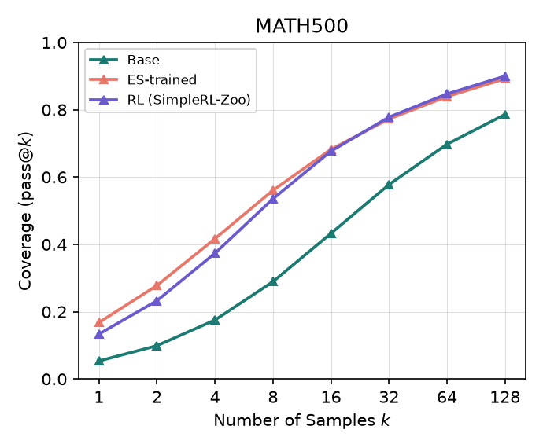
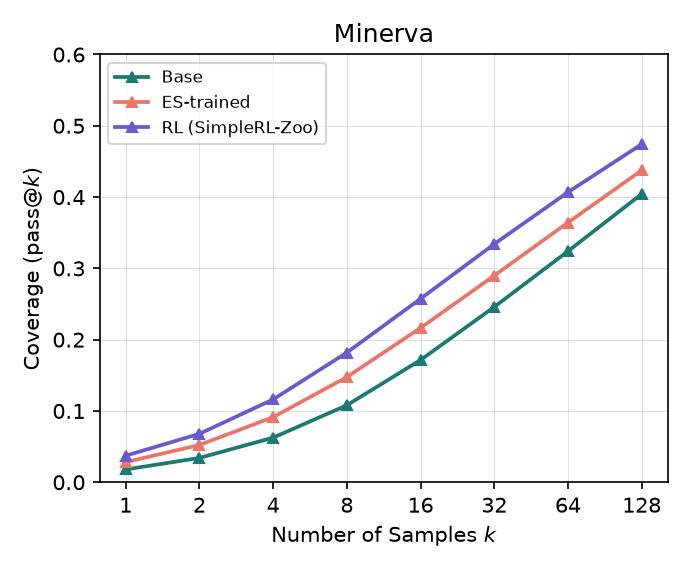
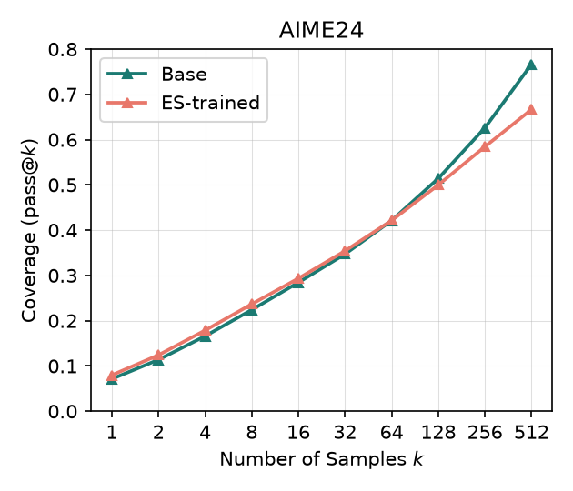
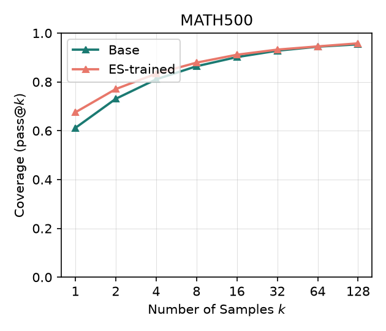
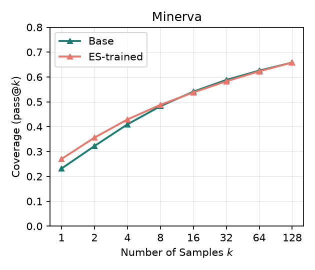

# ES-capacity

Does Evolution-Strategies post-training preserve a base model's pass@k
ceiling better than gradient-based RLVR (GRPO)? RLVR reliably raises pass@1
but tends to narrow the pass@k ceiling relative to the base model — this
project tests whether ES-based fine-tuning (gradient-free, population-based)
avoids that narrowing, on the same task/reward/data.

Run so far at two scales, with **opposite outcomes**: at 1.5B ES expands
question coverage on all 4 benchmarks with no pass@k crossover; at 7B, under
identical hyperparameters, the coverage gain nearly vanishes and 2 of 4
benchmarks cross over — the ceiling-narrowing pattern the RLVR paper
documents, now showing up in gradient-free ES. Separately, GPQA-diamond finds
no forgetting at either scale, and one unexplained *gain*
([below](#out-of-domain-check-gpqa-diamond)).

The RL arm throughout is a published SimpleRL-Zoo checkpoint, which saw
**12.01 epochs of the shared 8,523-problem training set against this ES run's
1.50** ([arithmetic](#results--experiment-1-qwen25-15b)) — so read every
ES-vs-RL row as ES on an exactly 8x smaller data budget, not as a matched
comparison.

Training and evaluation run from forked, patched copies of the original
papers' code.

## Code

| Purpose | Repo | Branch | Notes |
|---|---|---|---|
| ES training | [Jaysen-Ma/es-at-scale](https://github.com/Jaysen-Ma/es-at-scale) (fork of [VsonicV/es-at-scale](https://github.com/VsonicV/es-at-scale), arXiv:2509.24372) | `fix/multi-engine-colocation` | Full-rank ES, Ray-orchestrated multi-engine vLLM. 3 fixes needed to run on a single-node multi-GPU box: vLLM ≥0.20 import compat, co-located-engine port/cache-collision + concurrent-compile races, `--start-iteration` resume support. Verified on 8x RTX 4090. |
| pass@k generation, grading, plotting | [Jaysen-Ma/limit-of-RLVR](https://github.com/Jaysen-Ma/limit-of-RLVR) (fork of [LeapLabTHU/limit-of-RLVR](https://github.com/LeapLabTHU/limit-of-RLVR), arXiv:2504.13837) | `fix/math-equal-timeout-bypass` | `math/examples/math_eval/` already implements the unbiased pass@k estimator and a full generate+grade harness (`math_eval.py`, `--n_sampling`). Fixes a real grading-worker hang (`math_equal`'s equation-comparison branch bypassed the timeout guard). |

Both forks' `main` are kept as unmodified mirrors of upstream; all changes
live on the branches above so they can be sent upstream as PRs later.

## Experiment 1: Qwen2.5-1.5B base vs. ES-at-scale-trained (done)

| Param | Value |
|---|---|
| Model | `Qwen/Qwen2.5-1.5B` (base, not Instruct) |
| Task | math |
| sigma | 0.001 |
| alpha (lr) | auto (`sigma/2` = 0.0005, `es-at-scale`'s default when `--alpha` is unset) |
| Population size | 32 |
| Iterations | 50 |
| Train dataset | `math_lvl3to5_8k` — the same 8,523 problems, in the same order, as SimpleRL-Zoo's `simplelr_qwen_level3to5` split (verified against their released parquet) |
| Batch size / mini-batch size | 256 / 256 |
| Max tokens | 2048 |
| vLLM engines | 8 (one per GPU) |
| GPUs | 0-7 (8x RTX 4090 48GB) |
| Training wall-clock | 3h 22m 35s (including 2 evals) |

Train:
```bash
cd es-at-scale  # Jaysen-Ma/es-at-scale @ fix/multi-engine-colocation
python -m es_at_scale.train \
  --task math \
  --model-name Qwen/Qwen2.5-1.5B \
  --sigma 0.001 \
  --population-size 32 \
  --n-iterations 50 \
  --train-dataset datasets/train/math_lvl3to5_8k \
  --eval-dataset datasets/evaluation_suite/math \
  --batch-size 256 --mini-batch-size 256 \
  --max-tokens 2048 \
  --n-vllm-engines 8 --use-gpus 0,1,2,3,4,5,6,7
```
`--eval-dataset` matters even though this README's reported pass@k numbers
come from a separate eval pass (below), not the trainer's own in-loop eval —
omit it and it silently defaults to the `countdown` task's eval set, which
has no `problem` field and crashes the trainer the moment anything touches
the eval dataloader (e.g. resuming training from a checkpoint, see Experiment
2 below).

Evaluate (base, ES-trained, and any third arm, all through identical
settings, sharded across every GPU — `n_sampling` = 512 for AIME24, 128 for
the rest):
```bash
cd ES-capacity
scripts/run_base_vs_trained_eval.sh <path-to-hf-checkpoint> iter50-1.5b aime24 512
scripts/run_base_vs_trained_eval.sh <path-to-hf-checkpoint> iter50-1.5b math500 128
scripts/run_base_vs_trained_eval.sh <path-to-hf-checkpoint> iter50-1.5b minerva_math 128
scripts/run_base_vs_trained_eval.sh <path-to-hf-checkpoint> iter50-1.5b olympiadbench 128
# or all 4 at once:
scripts/run_full_eval_suite.sh <path-to-hf-checkpoint> iter50-1.5b

# third-arm (e.g. an RL baseline), reusing the base model's already-computed outputs:
scripts/run_third_model_full_suite.sh <third-model-dir> rl iter50-1.5b [n_sampling_override]
```
`convert_to_hf.py` first, if starting from a raw `es-at-scale` checkpoint —
see [Model](#model) below. Both wrappers take an optional trailing
`base_model_dir` (added for Experiment 2); it defaults to the Qwen2.5-1.5B
snapshot used here.

### Evaluation wall-clock

Per-benchmark generation time (base, ES-trained, RL), 8x RTX 4090 48GB,
sharded across all 8 GPUs, `n_sampling`/model/benchmark as above:

| Benchmark | Base | ES-trained | RL |
|---|---|---|---|
| AIME24 (n=512) | 5m23s | 4m34s | 5m24s |
| MATH500 (n=128) | 3m38s | 2m40s | 3m18s |
| Minerva (n=128) | 4m32s | 4m08s | 5m05s |
| OlympiadBench (n=128) | 5m54s | 9m41s | 7m33s |
| **Total** | **19m27s** | **21m02s** | **21m20s** |

Grand total across all 3 models, 4 benchmarks: ~1h2m.

## Results — Experiment 1 (Qwen2.5-1.5B)

Three models compared on four benchmarks (AIME24, MATH500, Minerva Math,
OlympiadBench) at identical generation settings throughout (`temperature=0.6`,
`top_p=0.95`, `max_tokens=2048`, `qwen-boxed` template, `seed=1` — enforced by
shared wrapper scripts so runs can't drift: `scripts/run_base_vs_trained_eval.sh`,
`scripts/run_third_model_eval.sh`). `n_sampling` (= max k) is 512 for AIME24,
128 for the rest; each benchmark's full data range gets its own pass@k curve.

- **Base**: `Qwen/Qwen2.5-1.5B`
- **ES**: this project's Experiment 1 checkpoint
- **RL**: [hkust-nlp/Qwen-2.5-1.5B-SimpleRL-Zoo](https://huggingface.co/hkust-nlp/Qwen-2.5-1.5B-SimpleRL-Zoo),
  a real published GRPO-trained model, same base and (matched) training data

<table>
<tr>
<td></td>
<td></td>
</tr>
<tr>
<td></td>
<td></td>
</tr>
</table>

Per-k numbers for all three arms: **[results/README.md](results/README.md)**.

**ES vs. base: no crossover on any of the 4 benchmarks** — ES stays above
base across the entire k range tested, unlike the pass@k-ceiling-narrowing
pattern the source RLVR paper documents for gradient-based methods. (This is
the finding [Experiment 2](#results--experiment-2-7b) fails to reproduce at
7B.)
Solvable/unsolvable breakdown ("solvable" = at least 1 of `n_sampling`
completions correct) confirms this nets positive everywhere, gains
consistently outweighing losses:

| Benchmark | ES: narrow / gain / **net** | RL: narrow / gain / **net** |
|---|---|---|
| AIME24 | 0.0% / 13.3% / **+13.3** | 3.3% / 30.0% / **+26.7** |
| MATH500 | 1.4% / 12.0% / **+10.6** | 1.2% / 12.6% / **+11.4** |
| Minerva | 7.0% / 10.3% / **+3.3** | 5.5% / 12.5% / **+7.0** |
| OlympiadBench | 3.9% / 13.3% / **+9.4** | 3.4% / 12.9% / **+9.5** |

**ES vs. RL is a mixed picture, not a clean win for either.** RL narrows
*less* than ES on 3 of 4 benchmarks and matches or exceeds ES's net gain on
all 4. No consistent crossover pattern either:

- **AIME24**: RL and ES are essentially tied through k≈16, then RL's lead
  *grows* with k, reaching pass@512 = 50.0% vs ES's 36.7% (n=30 questions
  here, so the noisiest of the four benchmarks).
- **MATH500**: RL starts *below* ES at low k (pass@1: 13.4% vs 16.8%),
  crosses over around k≈16-32, finishes slightly ahead at k=128 (90.0% vs
  89.2%).
- **Minerva**: RL stays above ES at every k from 1 to 128, gap plateauing
  around +3.5 to +4.4 points by k≥16.
- **OlympiadBench**: the two stay close throughout (within ±1 point),
  converging to a near-exact tie by k=128.

**Not a compute-matched comparison — the data budgets differ by exactly 8x.**
Both arms train on the same **8,523 problems** (SimpleRL-Zoo's
`simplelr_qwen_level3to5` split; verified identical, same order). They pass
over it a very different number of times:

| | Prompts/step | Steps | Prompt-exposures | **Epochs over the 8,523** | Generations |
|---|---|---|---|---|---|
| **ES** (this run) | 256 | 50 | 12,800 | **1.50** | 409,600 (x32 population) |
| **RL** (SimpleRL-Zoo 1.5B) | 1,024 | ~100 | 102,400 | **12.01** | 819,200 (x8 rollouts) |

SimpleRL-Zoo's published recipe is "a prompt batch size of 1,024 and 8 rollouts
per prompt" (arXiv:2503.18892 §B.5), and its Qwen2.5-1.5B training curves run
to ~100 steps — so the released checkpoint has made **12.01 passes over the
data where this ES run made 1.50**, at 2x the raw generation count. The
exposure ratio is exactly 8.00x and does not depend on the dataset size.

Two caveats on those figures. The step count is read off their per-model
figures, since the paper never states RL epochs directly. And the paper
describes the split as "approximately 8,000 problems" (§3.2) — dividing by that
round number is where the commonly-quoted **12.8** epochs comes from; against
the actual 8,523-row file it is 12.01, and the matching ES figure moves 1.60 →
1.50. Either pairing gives the same 8.00x.

That reframes the ES-vs-RL rows above: RL matching or slightly beating ES here
is what an 8x larger data budget should buy. It doesn't rule out ES preserving
capacity better under matched compute — that comparison still hasn't been run.
What holds regardless, at this scale: ES itself shows no crossover and a clean
net-positive result relative to the base model on all 4 benchmarks, off 1.50
epochs.

## Experiment 2: Qwen2.5-7B base vs. ES-at-scale-trained (done)

Same task, same reward, same data, same ES hyperparameters as Experiment 1 —
**only the base model changes** (1.5B → 7B). No retuning turned out to be
needed on the same 8x RTX 4090 48GB box. The point is to test whether
Experiment 1's clean capacity-expansion result is a property of ES or a
property of a small, weak base model with a lot of headroom.

| Param | Value |
|---|---|
| Model | `Qwen/Qwen2.5-7B` (base, not Instruct) |
| Task | math |
| sigma | 0.001 |
| alpha (lr) | auto (`sigma/2` = 0.0005, `--alpha -1`) |
| Population size | 32 |
| Iterations | 50 (`--n-iterations 50`; the trainer actually runs 51 — an off-by-one in `es-at-scale`'s loop that applies to Experiment 1 too) |
| Train dataset | `math_lvl3to5_8k` (8,523 problems, as Experiment 1) |
| Batch size / mini-batch size | 256 / 256 |
| Max tokens | 2048 |
| Seed | 42 |
| vLLM engines | 8 (one per GPU) |
| GPUs | 0-7 (8x RTX 4090 48GB) |
| Training wall-clock | 4h 35m 33s (~300s/iteration, near-constant; includes the baseline and final eval passes the training script runs itself) |
| W&B | none (`--logging none`) — per-iteration stats come from the trainer's stdout, kept in the `es-at-scale` working tree, not this repo |

Train:
```bash
cd es-at-scale  # Jaysen-Ma/es-at-scale @ fix/multi-engine-colocation
python -m es_at_scale.train \
  --task math \
  --model-name Qwen/Qwen2.5-7B \
  --experiment-name qwen7b-math-run \
  --sigma 0.001 \
  --population-size 32 \
  --n-iterations 50 \
  --train-dataset datasets/train/math_lvl3to5_8k \
  --eval-dataset datasets/evaluation_suite/math \
  --batch-size 256 --mini-batch-size 256 \
  --max-tokens 2048 \
  --n-vllm-engines 8 --use-gpus 0,1,2,3,4,5,6,7
```
See the `--eval-dataset` note under Experiment 1 above — it's easy to forget
since this run doesn't crash without it (only a later `--checkpoint` resume
does), but the trainer's in-loop eval would still silently be scoring the
wrong task.

Evaluate — same wrappers and same fixed settings as Experiment 1, with the 7B
base passed explicitly as the trailing `base_model_dir`:
```bash
cd ES-capacity
scripts/run_full_eval_suite.sh \
  /workspace/es-at-scale/experiments/qwen7b-math-run/hf-checkpoint-iter50 \
  iter50-7b \
  /workspace/.hf_home/hub/models--Qwen--Qwen2.5-7B/snapshots/d149729398750b98c0af14eb82c78cfe92750796
```

### Evaluation wall-clock

Base then ES-trained, sequential per benchmark, same 8-GPU sharding. No RL arm
was run at 7B (see [Later](#later)).

| Benchmark | Gens/model | Base | ES-trained | Base gen/s | ES gen/s |
|---|---|---|---|---|---|
| AIME24 (n=512) | 15,360 | 13m41s | 13m12s | 18.7 | 19.4 |
| MATH500 (n=128) | 64,000 | 11m19s | 26m07s | 94.3 | 40.8 |
| Minerva (n=128) | 34,816 | 24m33s | 25m07s | 23.6 | 23.1 |
| OlympiadBench (n=128) | 86,400 | 40m21s | 43m17s | 35.7 | 33.3 |
| **Total generation** | | **1h30m** | **1h48m** | | |

Full suite wall-clock (launch → "All benchmarks complete"): **≈3h35m**; the
~18min over the 3h17m of generation is model-loading/private-copy overhead
across the 8 base/trained loads.

**The ES-trained model generates ~2.3x slower on MATH500 and at parity on the
other three.** Working theory: ES makes it markedly more accurate on the easy
benchmark (46.8% → 71.4% on the training suite's own eval) and it now spends
more tokens per answer on problems it used to answer quickly and
superficially — MATH500 median response length rises 445 → 503 tokens between
the training script's baseline and final eval passes. On the hard benchmarks
both models already run near the 2048-token cap, so there is no "quick guess"
behavior to slow down from and throughput converges (18.7 vs 19.4, 23.6 vs
23.1, 35.7 vs 33.3 — all within noise).

## Results — Experiment 2 (7B)

**Experiment 1's result does not replicate at 7B.** ES still buys a real
pass@1 gain on every benchmark, but the gain shrinks monotonically with k, the
curves cross on 2 of 4 benchmarks, and on AIME24 the *base* model finishes far
ahead:

| Benchmark | pass@1 base → ES | pass@max base → ES | narrow / gain / **net** |
|---|---|---|---|
| AIME24 (n=30, k≤512) | 7.14% → 7.98% | 76.67% → 66.67% | 13.3% / 3.3% / **−10.0** |
| MATH500 (n=500, k≤128) | 61.15% → 67.54% | 95.40% → 95.80% | 1.0% / 1.4% / **+0.4** |
| Minerva (n=272, k≤128) | 23.14% → 26.99% | 65.81% → 65.81% | 2.9% / 2.9% / **0.0** |
| OlympiadBench (n=675, k≤128) | 27.95% → 32.39% | 74.67% → 76.30% | 3.4% / 5.0% / **+1.6** |

<table>
<tr>
<td></td>
<td></td>
</tr>
<tr>
<td></td>
<td></td>
</tr>
</table>

The shape is clearest as ES − base in points, per k:

| k | AIME24 | MATH500 | Minerva | OlympiadBench |
|---|---|---|---|---|
| 1 | +0.85 | +6.39 | +3.85 | +4.44 |
| 2 | +1.03 | +3.99 | +3.39 | +3.95 |
| 4 | +1.27 | +2.32 | +1.97 | +3.38 |
| 8 | +1.26 | +1.48 | +0.53 | +2.88 |
| 16 | +0.90 | +0.97 | −0.32 | +2.32 |
| 32 | +0.69 | +0.45 | −0.55 | +2.01 |
| 64 | +0.01 | +0.12 | −0.29 | +1.91 |
| 128 | −1.44 | +0.40 | ±0.00 | +1.63 |
| 256 | −4.17 | — | — | — |
| 512 | **−10.00** | — | — | — |

Per benchmark:

- **AIME24**: the clean textbook case of the tradeoff — ES ahead through
  k≈32, tied at k=64, then falling behind, ending 10 points down at pass@512
  (76.7% base vs 66.7% ES). In question terms ES loses 4 of the 23 questions
  base can solve at k=512 and gains 1. n=30, so this is the noisiest curve of
  the four, but it is also the largest effect, and it is corroborated by the
  training suite's own AIME eval falling 16.7% → 6.7% over the run.
- **MATH500**: no crossover, but the gap collapses from +6.4 at k=1 to +0.4 at
  k=128. Both models are near-saturated by then (95.4% / 95.8%) — there is
  almost no ceiling left to move.
- **Minerva**: crosses at k≈16 and stays marginally below base through k=64,
  converging to an exact tie at k=128 (65.81% both). The dips are ≤0.6 points
  — read this as "flat ceiling", not real narrowing.
- **OlympiadBench**: the only benchmark that still looks like Experiment 1 —
  ES above base at every k, with the gap shrinking (+4.4 → +1.6) but never
  closing. Also the largest question set (675) and the only one with a clear
  net gain.

**Caveat that cuts both ways — headroom.** The 7B base is far stronger than
1.5B (MATH500 pass@128: 95.4% vs 78.6%; OlympiadBench 74.7% vs 44.7%), so
there is much less ceiling available to expand into, and a fixed 50-iteration
ES budget is a proportionally smaller intervention on a 7B model. Some of the
shrinking net gain is that, not necessarily "ES stops working at scale". What
this cannot explain is AIME24, where the ceiling *dropped* by 10 points — that
is capability loss, not saturation.

### The two experiments together

Net question-coverage change (gain − narrow), same ES recipe at both scales:

| Benchmark | 1.5B | 7B |
|---|---|---|
| AIME24 | **+13.3** | **−10.0** |
| MATH500 | **+10.6** | **+0.4** |
| Minerva | **+3.3** | **0.0** |
| OlympiadBench | **+9.4** | **+1.6** |

At 1.5B, ES looked like genuine capacity expansion. At 7B, the same recipe
looks like an almost pure sampling-efficiency gain — pass@1 up on all four
benchmarks, ceiling flat on three and down sharply on the fourth. That is the
profile the source RLVR paper attributes to gradient-based RLVR, which
weakens the project's original framing: "gradient-free ES avoids the
narrowing" does not hold as a scale-independent claim on this evidence.

Two honest limits on that conclusion: the 7B base has far less headroom (see
the caveat above), and there is still no compute-matched RL arm at either
scale — so this says something about ES across scale, and still nothing
rigorous about ES *versus* RLVR.

## Out-of-domain check: GPQA-diamond

All post-training here is math-only, so the obvious question is what it costs
elsewhere. GPQA-diamond zero-shot (198 graduate-level science questions,
4-choice, scored by log-likelihood — **not** pass@k; a different probe than
everything above), run across all 6 arms with `lm_eval`:

| Arm | acc | vs. its base | McNemar (paired, exact) |
|---|---|---|---|
| 1.5B base | 26.3% (52/198) | — | — |
| 1.5B ES | **34.8% (69/198)** | **+8.6** | 27 gained / 10 lost, **p = 0.008** |
| 1.5B RL (SimpleRL-Zoo) | 27.3% (54/198) | +1.0 | 5 gained / 3 lost, p = 0.73 |
| 7B base | 32.8% (65/198) | — | — |
| 7B ES | 31.8% (63/198) | −1.0 | 9 gained / 11 lost, p = 0.82 |
| 7B RL (SimpleRL-Zoo) | 32.8% (65/198) | ±0.0 | 2 gained / 2 lost, p = 1.00 |

**No forgetting anywhere** — no arm drops meaningfully below its base. The
surprise is the other direction: **math-only ES training at 1.5B improves
out-of-domain science QA by 8.6 points**, the only change in the table that
survives a paired test. Note where it starts from: 4-choice chance is 25%, and
1.5B base (26.3%) and 1.5B RL (27.3%) are both indistinguishable from
guessing, so ES is the only 1.5B arm doing better than chance at all. Whether
that is real science knowledge or just better-calibrated option scoring on a
model that could previously do neither, this run can't say.

At 7B, all three arms sit together at ~32% and every pairwise difference is
noise. (7B base and 7B RL score identically at 65/198 but disagree on 4
questions — coincidence, not a duplicated run.)

This lines up with the scale story above: at 1.5B the ES run was a large
intervention on a weak model and moved things in *both* domains; at 7B it was
a small intervention and moved neither. It also means Experiment 2's AIME24
narrowing is not part of some general degradation — nothing outside math
regressed.

Driver: `scripts/run_gpqa_sweep.sh` (single GPU, vLLM backend, ~1.5 min/model,
~9 min for the sweep). Per-arm scores: [results/README.md](results/README.md).

## Training dynamics

Experiment 2 ran with `--logging none`, so there is no W&B run behind it — its
per-iteration stats come from the trainer's stdout, which records reward only.
Both runs are therefore reported the same way here. Reward across the
population of 32, at four points in each 51-iteration run:

| | Iter 1 | Iter 10 | Iter 25 | Iter 51 |
|---|---|---|---|---|
| Mean reward — 1.5B | 0.014 | 0.083 | 0.400 | 0.428 |
| Mean reward — 7B | 0.457 | 0.549 | 0.702 | 0.654 |
| Std — 1.5B | 0.009 | 0.045 | 0.037 | 0.020 |
| Std — 7B | 0.050 | 0.044 | 0.018 | 0.017 |

Both follow the same shape — reward climbs, plateaus around iteration ~25, std
decays as the population converges — with two differences worth noting. The 7B
run *starts* at 0.457, above where the 1.5B run *finishes* (0.428), so nearly
all of the 1.5B run's headroom on the training reward simply isn't there; total
improvement is +0.20 (7B) vs +0.41 (1.5B). And 7B's std decays monotonically
instead of peaking early around iteration ~10-15 — the population never gets
the broad early exploration phase the 1.5B run had. Both are noisy after the
plateau (7B bounces 0.61-0.70), i.e. the last ~25 iterations buy little.

W&B additionally captured response length for Experiment 1, with no 7B
counterpart to compare against: the population mean *falls* the whole run,
~1708 tokens at iteration 1 to ~787 by iteration 51, so the 1.5B model learns
to be **more concise while getting more correct** — not to think longer.
Full per-iteration series: `results/iter50-1.5b/training_curves.csv`
(`scripts/plot_training_curves.py` will plot it, or regenerate from
`--wandb-run chunhinma00-personal/es-finetuning/it2de910`).

The training script runs its own eval suite too (single-sample pass@1, its own
prompt/sampling settings — **not** comparable to the pass@k harness numbers
above). For **Experiment 2 (7B)**, baseline vs. final:

| Task | Baseline | Iter 50 |
|---|---|---|
| AIME | 16.7% | **6.7%** |
| AMC | 34.9% | 41.0% |
| MATH500 | 46.8% | 71.4% |
| Minerva | 21.0% | 34.6% |
| OlympiadBench | 28.9% | 37.2% |

Large gains everywhere except AIME, which halves — an independent signal for
the AIME24 narrowing seen in the pass@k results (different harness, different
settings, same direction).

## Model

Both ES-trained checkpoints are published, in HF format, converted from the raw
`es-at-scale` checkpoints with `scripts/convert_to_hf.py --verify`:

| Experiment | Checkpoint |
|---|---|
| 1 (1.5B) | [zocrate/Qwen2.5-1.5B-ES-math](https://huggingface.co/zocrate/Qwen2.5-1.5B-ES-math) |
| 2 (7B) | [zocrate/Qwen2.5-7B-ES-math](https://huggingface.co/zocrate/Qwen2.5-7B-ES-math) |

## Later

- **Chase the 1.5B GPQA gain.** +8.6 points out-of-domain from math-only ES
  training (p = 0.008) is the most interesting unexplained result in the repo,
  and it rests on 198 questions against a base model at chance. Worth a second
  seed and a second out-of-domain benchmark (MMLU-STEM, ARC-Challenge) before
  claiming transfer.
- **Is AIME24's 7B narrowing real or n=30 noise?** It is the strongest result
  in Experiment 2 and rests on 30 questions (4 lost, 1 gained). Worth a second
  seed, or AIME25/AMC as an independent hard-benchmark check, before leaning
  on it.
- **Headroom confound.** Experiment 2 changed base-model strength and left the
  ES budget fixed, so "7B has less headroom" and "ES scales worse" aren't
  separated. A longer 7B run (150-200 iterations, ~14-18h at the observed
  ~300s/iteration) would tell them apart: if it's headroom, more iterations
  keep moving pass@1 without further ceiling loss.
- No RL arm in the 7B pass@k suite (`hkust-nlp/Qwen-2.5-7B-SimpleRL-Zoo` is
  downloaded and is in the GPQA sweep, just not the math suite — another ~2h
  of generation).
- A compute-matched RL baseline (capped at similar wall-clock/FLOP budget to
  the ES run, rather than comparing against an already fully-trained public
  checkpoint) would make the ES-vs-RL comparison fair — currently open at both
  scales.
- A fourth arm testing EGGROLL (Sarkar et al., arXiv:2511.16652 — rank-r
  LoRA-factorized ES, as opposed to `es-at-scale`'s full-rank ES).
